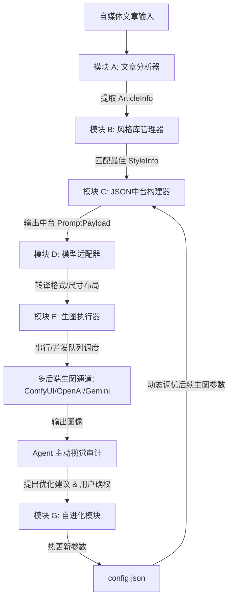
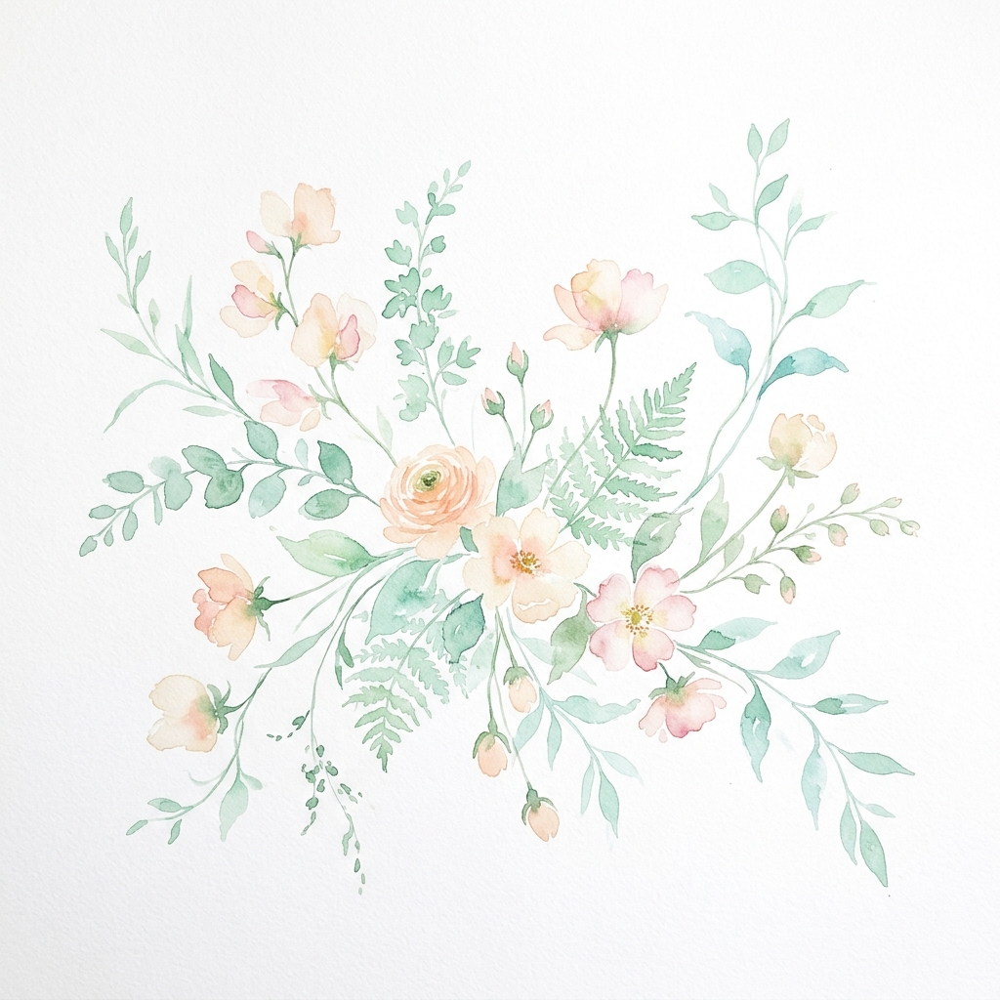
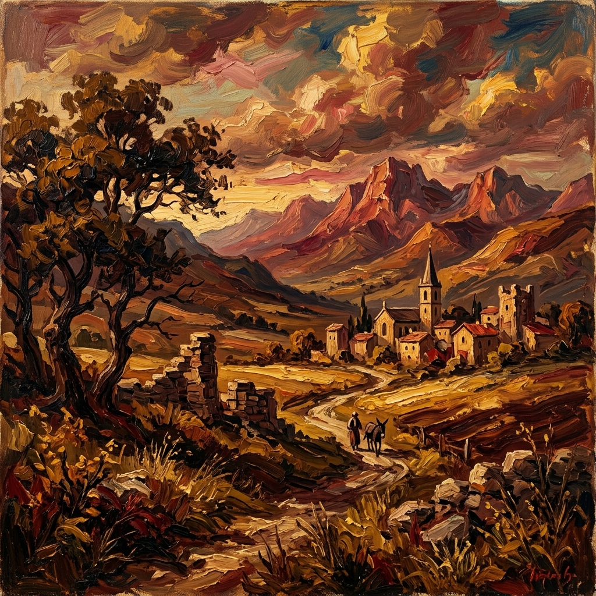

# Creative Visual Skill (CVSkill) — 自媒体视觉策划与跨模型生图中台

一个独立于具体运行平台、模块化设计的**“自媒体视觉策划 + 跨模型生图”**能力模块。系统通过定义统一的中台语义数据结构和交互协议，可以在本地 Python 脚本、Claude Skills、OpenAI Assistants、n8n 工作流、或自建 Agent 框架中无缝部署。

---

## 📌 项目定位

* **输入端**：自媒体长文章 / 公众号文章 (+ 可选的用户个性化风格素材，如特定的提示词与参考图)。
* **中台层**：统一的 JSON 提示词结构（`PromptPayload`），作为跨模型适配的“唯一真相源”。
* **输出端**：自适应生成公众号封面图 (宽幅 2.35:1) 与正文配图 (16:9 等)。
* **生图通道**：支持本地 ComfyUI API（Flux / SDXL 模型等）及云端生图接口（OpenAI / Gemini API 等）。
* **素材积累与演进**：支持“风格内容库”沉淀（Markdown 文件 + 物理素材图）以及基于用户真实反馈的配置“自进化”调优。

### 🏷️ 版本控制
* **当前版本**：`1.0.0`
* **版本特征**：
  * **V1（规则驱动级）**：已完整实现并打通。支持基于 `jieba` 中文分词的文章分析、标签交集匹配的风格推荐、ComfyUI 宽幅布局翻译、基于特定触发词的风格注入确权、以及规则匹配自进化。
  * **V2（大模型增强级）**：已在代码中完整保留入口。通过在 `creative_visual_skill/.env` 中配置 `OPENAI_API_KEY` 或 `GEMINI_API_KEY`，并带上 `--use-llm` 命令行参数，即可启用基于高级 Agent 的文章主体语义提取、大模型风格库结构化生成、以及 LLM Agent 诊断自进化调参。

---

## 📂 项目结构

```bash
.
├── .gitignore                  # Git 忽略配置文件
├── README.md                   # 仓库主说明文档 (v1.0.0)
├── SKILL.md                    # Agentic Skill 模块调用声明文件
│
└── creative_visual_skill/      # CVSkill 能力模块根目录
    ├── main.py                 # CLI 主入口、交互式向导及 Agent 审计确权系统
    ├── config.py               # 全局配置加载与写入模块
    ├── config.json             # 动态重写的运行时配置文件 (声明 "version": "1.0.0")
    ├── utils.py                # 核心数据类与辅助工具 (版本声明 "1.0.0")
    ├── article_analyzer.py     # 模块A：文章分析器 (V1分词 / V2大模型分析)
    ├── style_library.py        # 模块B：风格库管理器 (Markdown JSON 解析与匹配评分)
    ├── json_builder.py         # 模块C：中台 Payload 构建器
    ├── model_adapter.py        # 模块D：跨提供商提示词适配转译器
    ├── image_runner.py         # 模块E：生图执行器 (ComfyUI 串行 / OpenAI / Gemini)
    ├── save_style.py           # 模块F：素材注入与二次确权流程
    ├── evolver.py              # 模块G：规则/LLM自进化优化模块
    ├── requirements.txt        # 项目依赖
    │
    ├── styles/                 # 风格素材库
    │   ├── style_library.md    # 风格库模板定义 (预置 6 大主流风格)
    │   └── image/              # 预置 6 大风格的完整样例图片与用户素材目录
    │
    ├── workflows/              # ComfyUI API 工作流模板
    │   ├── sdxl_basic.json     # SDXL 基础工作流 API
    │   └── flux_basic.json     # Flux 基础工作流 API
    │
    ├── logs/                   # 日志目录
    │   ├── run.log             # 运行日志
    │   └── evolution.log       # 自进化日志
    │
    ├── output/                 # 最终生成的图片输出目录 (附 .gitkeep)
    │
    └── tests/                  # 完备单元测试套件 (包含 32 个 pytest 用例)
```

---

## ⚙️ 核心流程拓扑图



---

## 🛠️ 参数与命令行参考表

| 参数项 | 参数值类型 | 默认值 | 作用描述 | 命令行示例 |
|---|---|---|---|---|
| `--article` | string | 无 | 直接传入长文章文本内容进行生图 | `--article "陪伴是最长情的告白..."` |
| `--article-file` | string | 无 | 传入文章本地 TXT/MD 文件路径 | `--article-file my_article.txt` |
| `--style` | string | 自动匹配 | 强制指定特定的风格模板（跳过推荐评分） | `--style "极简扁平设计风"` |
| `--type` | string | `both` | 生成类型：`cover`(封面宽图)、`content`(正文配图) 或 `both` | `--type cover` |
| `--provider` | string | `local` | 指定底层渲染后端：`local`(本地ComfyUI)、`openai`、`gemini` | `--provider openai` |
| `--use-llm` | flag | False | 启用 V2 大模型增强提取（文章分析/风格解析/自进化） | `--use-llm` |
| `--save-style` | string | 无 | 素材/爆款提示词注入指令（需包含特定触发词） | `--save-style "保存到视觉库：..."` |
| `--optimize` | string | 无 | 传入负面意见反馈以手动触发 Evolver 调参 | `--optimize "生成的封面太空旷了"` |
| `--list-styles` | flag | False | 列出风格库 `style_library.md` 中所有载入的模板 | `--list-styles` |
| `--interactive` | flag | False | 启动极简的控制台向导交互模式 | `--interactive` |

---

## 🎨 预置视觉风格矩阵 (Styles)

风格模板统一保存在 `creative_visual_skill/styles/style_library.md` 中：

| 风格名称 | 推荐配色 (Colors) | 构图特征 (Composition) | 背景设定 (Background) | 示例路径 (Examples) |
|---|---|---|---|---|
| **复古剪贴簿拼贴风** | 暖琥珀色、淡黄芥末色、赭石色、玫瑰粉色、奶油白、深褐灰色 | 多层纸张重叠、撕边、纸胶带装饰，融入复古邮票 and 手写笔记点缀，突出主体 | 咖啡渍、纸张颗粒感与轻微折痕的古朴牛皮纸 | [](creative_visual_skill/styles/image/vintage_sample.png) |
| **赛博朋克霓虹风** | 电子蓝、极客品红、青色、深紫、霓虹粉、纯黑 | 汇聚的霓虹线条网格、全息UI图层、故障艺术条带，主体带霓虹光晕 | 细雨打湿的城市剪影，弥漫迷雾，反射霓虹广告牌光晕 | [](creative_visual_skill/styles/image/cyberpunk_sample.png) |
| **清新水彩插画风** | 薄荷绿、腮红粉、天空蓝、薰衣草紫、淡柠檬黄、蜜桃橙 | 湿画法晕染、细腻钢笔淡彩撕边、留白。主体以写意笔触呈现，伴随植物花草 | 纹理清晰的白色水彩纸，带有向边缘淡化的柔和渐变色晕 | [](creative_visual_skill/styles/image/watercolor_sample.png) |
| **极简扁平设计风** | 纯白、炭黑、珊瑚红、天空蓝、柔和灰、暗青 | 纯几何形状拼接、无渐变平面色块，非对称三分法，极简呼吸感留白 | 纯色无渐变背景，突出图形本身的视觉冲击力 | [](creative_visual_skill/styles/image/minimalist_sample.png) |
| **油画质感艺术风** | 深红、深褐、金土黄、普鲁士蓝、象牙白、橄榄绿 | 戏剧性斜射强光（明暗对照法法）、强烈的对角线引导线，明显的颜料堆叠肌理 | 略带烟雾感的多层深色油画画布，可见刮刀堆叠和上光油折射肌理 | [](creative_visual_skill/styles/image/oilpainting_sample.png) |
| **日系治愈手绘风** | 暖奶油白、柔珊瑚色、粉末蓝、淡黄、樱花粉、抹茶绿 | 圆润柔和形状、暖心氛围、彩铅线条勾画，点缀以小星星、花瓣等小细节 | 带着浅浅手绘描边格子的浅黄奶油色卡纸 | [](creative_visual_skill/styles/image/japanese_sample.png) |


---

## 📐 尺寸映射与画布布局规范

| 画面宽高比 (Ratio) | 目标像素尺寸 (px) | 触发布局适配逻辑 (Model Adapter) | 典型应用场景 |
|---|---|---|---|
| **`2.35:1`** (默认封面) | 1024 × 440 | 强制追加水平宽幅构图词，并在画面**右侧保留大片干净留白**以放置文字，主体约束在左侧 1/3。 | 公众号大图封面 / Widescreen Banner |
| **`16:9`** (默认正文) | 1344 × 768 | 适配宽视角电影画幅，采用平衡对称构图，保证画风稳定。 | 公众号正文插图 / 网页首图 |
| **`1:1`** | 1024 × 1024 | 居中构图，对称平衡布局。 | 朋友圈配图 / 社交头像 |
| **`3:2`** | 1216 × 832 | 经典摄影画幅比例。 | 摄影插图 / 测评配图 |
| **`21:9`** | 1536 × 640 | 宽视场广角电影画幅。 | 电影感宽画幅配图 |

---

## 🤖 Agent 主动视觉审计与双轨自进化环

生图完成后，系统启动 **Agent 主动视觉审计与双轨自进化** 机制。该机制包含以下两个诊断渠道：

### 1. 自动审计阶段 (仅在启用 `--use-llm` 且有可用图片时触发)
* **多模态视觉诊断**：Agent 自动将生成的图片输入多模态大模型（如 Gemini 2.0 / GPT-4o-mini），比对原始 Prompt 进行画质与构图评估：
  - **Skill 配置问题**：若检测到画面太挤、缺少留白或模糊，模型会在 JSON 响应的 `proposed_changes` 中输出调整参数。
  - **Model 能力限制**：若检测到文字写错、严重的肢体面部畸形等底层模型局限性，将其分类为 `model` 问题。
* **审计结果展示**：Agent 会自动在控制台打印自动诊断结论，说明当前画面质量。

### 2. 交互式诊断与用户确权阶段
如果在上一阶段未检测到问题，或在未使用 LLM 的离线模式下，Agent 会主动提请用户确认：
```text
  💬 请问您对本次生成的图片满意吗？如果需要优化微调，请简述您的改进意见。
     (若满意请直接按回车跳过诊断):
```
* **文本意见进化**：用户输入具体改进反馈（如“画面太挤了”或“有点模糊”）后，诊断模块会进行评估：
  - **路径 A (Skill 参数问题)**：Agent 展示具体调优方案，并提请用户确权：
    ```text
      🎯 诊断结论：画面过于拥挤，建议调高留白权重并减少元素数量上限。
      🔧 检测到待调优配置项（Skill 参数）：
         - whitespace_weight: 1.4
         - max_elements_per_image: 4
      ❓ 是否同意 Agent 自动修改配置文件并应用？(y/n): 
    ```
    输入 `y` 或 `yes` 后，系统自动覆写 `config.json` 并在下一次生图时生效。
  - **路径 B (Model 能力限制)**：Agent 会向用户指出模型缺陷，并提供合理的渲染后端切换建议（如“推荐尝试切换不同的生图后端，例如命令行追加 `--provider openai` 切换至 DALL-E 3，或者在 ComfyUI 中加载 Flux 模型”）。

---

## 📖 全链路生图示例 Walkthrough

以下是 CVSkill 分析一篇亲子教育类文章时的全链路底层转译逻辑展示。

### 1. 原始文章输入
> *"在家庭教育中，陪伴是最长情的告白。每一个孩子都需要父母的关爱和陪伴，这种温暖的亲子关系能够让孩子健康快乐地成长..."*

### 2. 模块 A 语义提取结果 (`ArticleInfo`)
```json
{
  "topic": "教育",
  "emotion": "温暖",
  "keywords": ["孩子", "陪伴", "成长"],
  "subject": "孩子"
}
```

### 3. 模块 B 与 C 组装唯一真相源中台 (`PromptPayload` - 封面比率 `2.35:1`)
```json
{
  "subject": "孩子",
  "style": "复古剪贴簿拼贴风",
  "composition": "Multi-layer collage composition with overlapping paper textures, torn edges, washi tape strips, vintage stamps, and hand-written annotations scattered across the frame. 孩子 placed as the central focal element with surrounding ephemera creating depth and visual interest.",
  "colors": ["warm amber", "faded mustard yellow", "burnt sienna", "dusty rose", "antique cream", "sepia brown"],
  "background": "Aged kraft paper background with coffee-stained textures, visible paper grain, subtle creases, and sun-faded spots giving an authentic scrapbook feel.",
  "ratio": "2.35:1",
  "negative": ["digital", "glossy", "neon colors", "3D render", "photorealistic", "cold tones", "modern minimalist", "sharp edges"],
  "tags": ["collage", "vintage", "scrapbook", "warm", "retro", "拼贴", "复古", "温暖"],
  "examples": ["styles/image/vintage_sample.png"]
}
```

### 4. 模块 D 翻译器对不同渲染引擎的适配

#### 本地 ComfyUI 引擎适配结果 (Positive, Negative)
* **Positive Prompt**:
  > `孩子, 复古剪贴簿拼贴风 style, Multi-layer collage composition with overlapping paper textures, torn edges, washi tape strips, vintage stamps, and hand-written annotations scattered across the frame. 孩子 placed as the central focal element with surrounding ephemera creating depth and visual interest., warm amber and faded mustard yellow and burnt sienna and dusty rose and antique cream and sepia brown color palette, Aged kraft paper background with coffee-stained textures, visible paper grain, subtle creases, and sun-faded spots giving an authentic scrapbook feel. background, masterpiece, best quality, high resolution, horizontal layout, ultra-wide cinematic composition, right side large whitespace area for text overlay, asymmetric composition with subject on left third, collage, vintage, scrapbook, warm, retro, 拼贴, 复古, 温暖`
* **Negative Prompt**:
  > `digital, glossy, neon colors, 3D render, photorealistic, cold tones, modern minimalist, sharp edges`

#### 云端 OpenAI DALL-E 引擎适配结果 (Natural Language Description)
* **Prompt Text**:
  > `Create an illustration of 孩子 in a 复古剪贴簿拼贴风 style. The composition features Multi-layer collage composition with overlapping paper textures, torn edges, washi tape strips, vintage stamps, and hand-written annotations scattered across the frame. 孩子 placed as the central focal element with surrounding ephemera creating depth and visual interest. Use a warm amber and faded mustard yellow and burnt sienna and dusty rose and antique cream and sepia brown color palette with an Aged kraft paper background with coffee-stained textures, visible paper grain, subtle creases, and sun-faded spots giving an authentic scrapbook feel. background atmosphere. The image should be in an ultra-wide cinematic 2.35:1 aspect ratio with a horizontal layout. Leave a large whitespace area on the right side for text overlay. Place the main subject on the left third of the frame using asymmetric composition. Additional style details: collage, vintage, scrapbook, warm, retro, 拼贴, 复古, 温暖. Reference style examples: styles/image/vintage_sample.png.`

---

## 📥 素材与风格入库指南

CVSkill 提供非常智能的风格/素材注入机制，支持从“文字描述”或“本地参考图片”两种通道提取并沉淀到风格库 `style_library.md`：

### 1. 基于文字描述注册
用户使用自然语言描述一种风格（需包含 `保存到内容库`、`存入素材` 等触发词）。
*   **主体自愈注入**：若描述中未包含 `[SUBJECT]` 占位符，且启用了 `--use-llm`，系统将在终端触发交互机制：
    *   `[1] 强行保存为固定无主体风格`：每次生图时主体固定。
    *   `[2] AI 自动推断并替换注入 [SUBJECT]`（推荐）：自动识别核心名词并替换，原物品名归入标签。
```bash
# 自动提取占位符
python -m creative_visual_skill.main --save-style "保存到内容库：老旧打字机放在牛皮纸上，暖黄色调" --use-llm
```

### 2. 基于本地参考图片直接注册（多模态视觉解析）
直接向 `--save-style` 传入一个合法的本地图片文件路径（如 `.png`/`.jpg`），系统将：
1.  调用 Vision LLM（如 Gemini 2.0 / GPT-4o-mini）逆向分析图片的构图、配色、背景，并自动抽象出 `[SUBJECT]`。
2.  将源图片自动保存/拷贝至 `styles/image/` 并将生成的风格 JSON 卡片追加写入 `styles/style_library.md`。
```bash
# 必须启用 --use-llm 以开启 Vision 分析
python -m creative_visual_skill.main --save-style "styles/image/vintage_sample.png" --use-llm
```

---

## 🛠️ 安装与运行

### 1. 依赖安装
```bash
cd creative_visual_skill
pip install -r requirements.txt
```

### 2. 交互式启动
```bash
# 设置 UTF-8 避免 Emoji 报错
$env:PYTHONIOENCODING="utf-8"
python -m creative_visual_skill.main --interactive
```

### 3. 测试检验
```bash
python -m pytest creative_visual_skill/tests/ -v
```
*43 项断言测试全数通过即可确认安装完好。*

